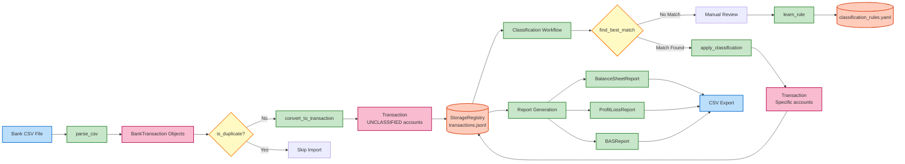

# small_business

Small business accounting and job management system for Australian sole traders. Features double-entry accounting, bank statement imports with auto-classification, quote/job/invoice lifecycle management, financial reporting (Balance Sheet, P&L, BAS/GST), and DOCX document generation.

## Package Architecture

### High-Level User Workflows

```mermaid
graph TB
    %% User Entry Points
    User([User])
    User --> Init[Initialize Business]
    User --> Import[Import Bank Statements]
    User --> Classify[Classify Transactions]
    User --> Workflow[Quote / Job / Invoice]
    User --> Report[Generate Reports]
    User --> DocGen[Generate Documents]

    %% Initialize Business Workflow
    Init --> init_business["init_business()"]
    init_business --> CreateDirs[Create Directory Structure]
    init_business --> CopyTemplates[Copy Chart of Accounts]
    init_business --> SaveSettings[Save Settings]

    %% Bank Import Workflow
    Import --> import_bank_statement["import_bank_statement()"]
    import_bank_statement --> parse_csv["parse_csv()"]
    import_bank_statement --> is_duplicate["is_duplicate()"]
    import_bank_statement --> convert_to_transaction["convert_to_transaction()"]
    import_bank_statement --> save_transaction["StorageRegistry.save_transaction()"]

    %% Classification Workflow
    Classify --> classify_and_review["classify_and_review()"]
    classify_and_review --> classify_transaction["classify_transaction()"]
    classify_transaction --> find_best_match["find_best_match()"]
    find_best_match --> match_pattern["match_pattern()"]
    classify_and_review --> apply_classification["apply_classification()"]
    classify_and_review --> learn_rule["learn_rule()"]
    classify_and_review --> save_rules["save_rules()"]

    %% Batch Classification
    Classify --> process_unclassified["process_unclassified_transactions()"]
    process_unclassified --> classify_and_review

    %% Business Lifecycle Workflow
    Workflow --> accept_quote["accept_quote_to_job()"]
    accept_quote --> SaveQuote[Save accepted quote version]
    accept_quote --> CreateJob[Create linked Job]
    Workflow --> complete_job["complete_job_to_invoice()"]
    complete_job --> CreateInvoice[Create Invoice from line items]
    complete_job --> MarkInvoiced[Mark job as invoiced]

    %% Report Generation Workflow
    Report --> gen_balance["generate_balance_sheet()"]
    Report --> gen_pl["generate_profit_loss_report()"]
    Report --> gen_bas["generate_bas_report()"]
    gen_balance --> calc_balance["calculate_account_balance()"]
    gen_pl --> calc_balance
    gen_bas --> calc_balance
    calc_balance --> get_all_txn["StorageRegistry.get_all_transactions()"]

    %% Export Reports
    gen_balance --> export_bs["export_balance_sheet_csv()"]
    gen_pl --> export_pl["export_profit_loss_csv()"]
    gen_bas --> export_bas["export_bas_csv()"]

    %% Document Generation Workflow
    DocGen --> gen_quote["generate_quote_document()"]
    DocGen --> gen_invoice["generate_invoice_document()"]
    gen_quote --> get_client["StorageRegistry.get_client()"]
    gen_quote --> get_settings["StorageRegistry.get_settings()"]
    gen_quote --> render_quote["render_quote_context()"]
    gen_invoice --> get_client
    gen_invoice --> get_settings
    gen_invoice --> render_invoice["render_invoice_context()"]

    %% Styling
    classDef userClass fill:#e1f5ff,stroke:#01579b,stroke-width:3px
    classDef highLevel fill:#c8e6c9,stroke:#2e7d32,stroke-width:2px
    classDef midLevel fill:#fff9c4,stroke:#f57f17,stroke-width:2px
    classDef lowLevel fill:#ffccbc,stroke:#d84315,stroke-width:2px

    class User userClass
    class init_business,import_bank_statement,classify_and_review,process_unclassified,accept_quote,complete_job,gen_balance,gen_pl,gen_bas,gen_quote,gen_invoice highLevel
    class parse_csv,convert_to_transaction,classify_transaction,apply_classification,learn_rule,calc_balance,render_quote,render_invoice midLevel
    class is_duplicate,find_best_match,match_pattern,save_rules,get_all_txn,get_client,get_settings lowLevel
```



### Module Hierarchy and Function Organization

```
small_business/                         # Root package
│
├── init_business.py                    # Business initialization
│   └── → init_business()               # Create business directory structure
│
├── workflows.py                        # Entity lifecycle transitions
│   ├── → accept_quote_to_job() ⭐      # Quote → Job (validates SENT, creates linked Job)
│   └── → complete_job_to_invoice() ⭐   # Job → Invoice (validates COMPLETED, creates Invoice)
│
├── models/                             # Data models (Pydantic)
│   ├── ● Client                        # Customer/client entity
│   ├── ● Quote                         # Sales quote (status: draft/sent/accepted/rejected/expired)
│   ├── ● Invoice                       # Customer invoice (status: draft/sent/paid/overdue/cancelled)
│   ├── ● Job                           # Work tracking (status: scheduled/in_progress/completed/invoiced)
│   ├── ● LineItem                      # Quote/invoice line items
│   ├── ● Account                       # Chart of accounts entry
│   ├── ● ChartOfAccounts               # Collection of accounts (loads from YAML)
│   ├── ● Transaction                   # Double-entry accounting transaction
│   ├── ● JournalEntry                  # Individual debit/credit entry
│   ├── ● Settings                      # Application configuration
│   ├── ● BankFormat / BankFormats      # Bank CSV format specifications
│   ├── ● QuoteStatus, JobStatus, InvoiceStatus, AccountType  # Enums
│   └── → generate_*_id()               # ID generation utilities
│       → get_financial_year()          # Financial year calculation (AU: Jul-Jun)
│
├── bank/                               # Bank statement import
│   ├── ● BankTransaction               # Single bank transaction
│   ├── ● ImportedBankStatement         # Collection of bank transactions
│   ├── → parse_csv()                   # Parse bank CSV file
│   ├── → convert_to_transaction()      # Convert bank txn to accounting txn
│   ├── → is_duplicate()                # Duplicate detection (field-based)
│   └── → import_bank_statement() ⭐    # Full import workflow (HIGH-LEVEL)
│
├── storage/                            # In-memory storage with disk persistence
│   └── ● StorageRegistry               # Central data access layer
│       │
│       │  # Clients (JSONL, case-insensitive lookup)
│       ├── → save_client(), get_client(), get_all_clients()
│       │
│       │  # Quotes (versioned JSON: {FY}/quotes/Q-*_v{N}.json)
│       ├── → save_quote(), get_quote(), get_all_quotes(), get_quote_versions()
│       │
│       │  # Invoices (versioned JSON: {FY}/invoices/INV-*_v{N}.json)
│       ├── → save_invoice(), get_invoice(), get_all_invoices(), get_invoice_versions()
│       │
│       │  # Jobs (versioned JSON: {FY}/jobs/JOB-*_v{N}.json)
│       ├── → save_job(), get_job(), get_all_jobs(), get_job_versions(), update_job()
│       │
│       │  # Transactions (JSONL per financial year)
│       ├── → save_transaction(), update_transaction(), get_transaction()
│       ├── → get_all_transactions(financial_year, start_date, end_date)
│       ├── → get_unclassified_transactions()      # Transactions with UNCLASSIFIED accounts
│       ├── → get_transactions_by_account()         # Filter by account code + date range
│       ├── → search_transactions()                 # Query, amount, account, date filtering
│       ├── → delete_transaction()                  # Remove from storage
│       ├── → void_transaction()                    # Create reversing entry
│       │
│       │  # Configuration
│       ├── → save_settings(), get_settings()
│       ├── → get_chart_of_accounts(), save_chart_of_accounts(), get_account_codes()
│       ├── → get_bank_formats(), save_bank_formats()
│       └── → reload()
│
├── classification/                     # Transaction classification
│   ├── ● ClassificationRule            # Pattern-based rule
│   ├── ● RuleMatch                     # Match result with confidence
│   ├── ● ClassificationResult          # Workflow result
│   ├── → classify_transaction()        # Classify single transaction
│   ├── → classify_batch()              # Classify multiple transactions
│   ├── → apply_classification()        # Apply rule to transaction
│   ├── → learn_rule()                  # Learn rule from user classification
│   ├── → save_rules() / load_rules()   # YAML persistence
│   ├── → classify_and_review() ⭐      # Classify with user feedback (HIGH-LEVEL)
│   ├── → process_unclassified_transactions() ⭐  # Batch classify and learn (HIGH-LEVEL)
│   ├── → classify_and_save() ⭐        # Classify and persist (HIGH-LEVEL)
│   └── → load_and_classify_unclassified() ⭐    # Load and classify batch (HIGH-LEVEL)
│
├── reports/                            # Financial reporting
│   ├── ● AccountBalance                # Typed model: account name + Decimal balance
│   ├── ● BalanceSheetReport            # Typed model: assets/liabilities/equity
│   ├── ● ProfitLossReport              # Typed model: income/expenses/net_profit
│   ├── ● BASReport                     # Typed model: GST collected/paid/net
│   ├── → calculate_account_balance()   # Get account balance as of date
│   ├── → get_account_transactions()    # Get transactions for account
│   ├── → generate_balance_sheet() ⭐   # Returns BalanceSheetReport
│   ├── → generate_profit_loss_report() ⭐  # Returns ProfitLossReport
│   ├── → generate_bas_report() ⭐      # Returns BASReport
│   ├── → export_balance_sheet_csv()    # Export balance sheet to CSV
│   ├── → export_profit_loss_csv()      # Export P&L to CSV
│   └── → export_bas_csv()              # Export BAS to CSV
│
└── documents/                          # Document generation (DOCX)
    ├── → render_quote_context()        # Build template context for quote
    ├── → render_invoice_context()      # Build template context for invoice
    ├── → generate_quote_document() ⭐  # Generate quote DOCX (HIGH-LEVEL)
    └── → generate_invoice_document() ⭐ # Generate invoice DOCX (HIGH-LEVEL)

Legend:
  ● = Data model/class (Pydantic)
  → = Function
  ⭐ = High-level entry point (user-facing workflow orchestrator)
```

### Data Flow: Bank Import to Reporting



### Business Lifecycle: Quote to Invoice

```mermaid
graph LR
    Q[Create Quote] --> Send[Send to Client]
    Send --> Accept["accept_quote_to_job()"]
    Accept --> Job[Job Created<br/>SCHEDULED]
    Job --> Start[Start Work<br/>IN_PROGRESS]
    Start --> Complete[Complete Work<br/>COMPLETED]
    Complete --> Invoice["complete_job_to_invoice()"]
    Invoice --> Inv[Invoice Created<br/>SENT]
    Inv --> Paid[Payment Received<br/>PAID]

    %% Styling
    classDef workflow fill:#c8e6c9,stroke:#2e7d32,stroke-width:2px
    classDef entity fill:#bbdefb,stroke:#1976d2,stroke-width:2px
    classDef action fill:#fff9c4,stroke:#f57f17,stroke-width:2px

    class Accept,Invoice workflow
    class Q,Job,Inv entity
    class Send,Start,Complete,Paid action
```



## Project Organization

- **[Copier](https://copier.readthedocs.io/)** - For templating and project generation
- **[uv](https://github.com/astral-sh/uv)** - For package and dependency management
- **[MkDocs](https://www.mkdocs.org/)** - For documentation with GitHub Pages deployment
- **[pytest](https://docs.pytest.org/)** - For testing with code coverage via pytest-cov
- **[pre-commit](https://pre-commit.com/)** - For enforcing code quality with ruff and codespell


## Development Setup

### Local Development

```bash
# Setup virtual environment and install dependencies
uv sync

# Install pre-commit hooks
pre-commit install-hooks
```

### Using VS Code DevContainer

1. Open project folder in VS Code
2. Install the "Remote - Containers" extension
3. Click "Reopen in Container" or run the "Remote-Containers: Reopen in Container" command
