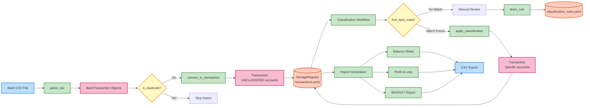

# small_business

small bussiness acount and job management

## Package Architecture

### High-Level User Workflows

```mermaid
graph TB
    %% User Entry Points
    User([User])
    User --> Init[Initialize Business]
    User --> Import[Import Bank Statements]
    User --> Classify[Classify Transactions]
    User --> Report[Generate Reports]
    User --> DocGen[Generate Documents]

    %% Initialize Business Workflow
    Init --> init_business["init_business()"]
    init_business --> CreateDirs[Create Directory Structure]
    init_business --> CopyTemplates[Copy Chart of Accounts]
    init_business --> SaveSettings[Save Settings]

    %% Bank Import Workflow
    Import --> import_bank_statement["import_bank_statement()"]
    import_bank_statement --> parse_csv["parse_csv()"]
    import_bank_statement --> is_duplicate["is_duplicate()"]
    import_bank_statement --> convert_to_transaction["convert_to_transaction()"]
    import_bank_statement --> save_transaction["StorageRegistry.save_transaction()"]

    %% Classification Workflow
    Classify --> classify_and_review["classify_and_review()"]
    classify_and_review --> classify_transaction["classify_transaction()"]
    classify_transaction --> find_best_match["find_best_match()"]
    find_best_match --> match_pattern["match_pattern()"]
    classify_and_review --> apply_classification["apply_classification()"]
    classify_and_review --> learn_rule["learn_rule()"]
    classify_and_review --> save_rules["save_rules()"]

    %% Batch Classification
    Classify --> process_unclassified["process_unclassified_transactions()"]
    process_unclassified --> classify_and_review

    %% Report Generation Workflow
    Report --> gen_balance["generate_balance_sheet()"]
    Report --> gen_pl["generate_profit_loss_report()"]
    Report --> gen_bas["generate_bas_report()"]
    gen_balance --> calc_balance["calculate_account_balance()"]
    gen_pl --> calc_balance
    gen_bas --> calc_balance
    calc_balance --> get_all_txn["StorageRegistry.get_all_transactions()"]

    %% Export Reports
    gen_balance --> export_bs["export_balance_sheet_csv()"]
    gen_pl --> export_pl["export_profit_loss_csv()"]
    gen_bas --> export_bas["export_bas_csv()"]

    %% Document Generation Workflow
    DocGen --> gen_quote["generate_quote_document()"]
    DocGen --> gen_invoice["generate_invoice_document()"]
    gen_quote --> get_client["StorageRegistry.get_client()"]
    gen_quote --> get_settings["StorageRegistry.get_settings()"]
    gen_quote --> render_quote["render_quote_context()"]
    gen_invoice --> get_client
    gen_invoice --> get_settings
    gen_invoice --> render_invoice["render_invoice_context()"]

    %% Styling
    classDef userClass fill:#e1f5ff,stroke:#01579b,stroke-width:3px
    classDef highLevel fill:#c8e6c9,stroke:#2e7d32,stroke-width:2px
    classDef midLevel fill:#fff9c4,stroke:#f57f17,stroke-width:2px
    classDef lowLevel fill:#ffccbc,stroke:#d84315,stroke-width:2px

    class User userClass
    class init_business,import_bank_statement,classify_and_review,process_unclassified,gen_balance,gen_pl,gen_bas,gen_quote,gen_invoice highLevel
    class parse_csv,convert_to_transaction,classify_transaction,apply_classification,learn_rule,calc_balance,render_quote,render_invoice midLevel
    class is_duplicate,find_best_match,match_pattern,save_rules,get_all_txn,get_client,get_settings lowLevel
```



### Module Hierarchy and Function Organization

```
small_business/                         # Root package
│
├── init_business.py                    # Business initialization
│   └── → init_business()               # Create business directory structure
│
├── models/                             # Data models (Pydantic)
│   ├── ● Client                        # Customer/client entity
│   ├── ● Quote                         # Sales quote/proposal
│   ├── ● Invoice                       # Customer invoice
│   ├── ● Job                           # Work tracking
│   ├── ● LineItem                      # Quote/invoice line items
│   ├── ● Account                       # Chart of accounts entry
│   ├── ● ChartOfAccounts               # Collection of accounts
│   ├── ● Transaction                   # Double-entry accounting transaction
│   ├── ● JournalEntry                  # Individual debit/credit entry
│   ├── ● Settings                      # Application configuration
│   ├── ● BankFormat                    # Bank CSV format specification
│   ├── ● QuoteStatus                   # Enum: draft, sent, accepted, rejected, expired
│   ├── ● JobStatus                     # Enum: scheduled, in_progress, completed, invoiced
│   ├── ● InvoiceStatus                 # Enum: draft, sent, paid, overdue, cancelled
│   ├── ● AccountType                   # Enum: asset, liability, equity, income, expense
│   └── → generate_*_id()               # ID generation utilities
│       → get_financial_year()          # Financial year calculation
│
├── bank/                               # Bank statement import
│   ├── ● BankTransaction               # Single bank transaction
│   ├── ● ImportedBankStatement         # Collection of bank transactions
│   ├── → parse_csv()                   # Parse bank CSV file
│   ├── → convert_to_transaction()      # Convert bank txn to accounting txn
│   ├── → is_duplicate()                # Duplicate detection
│   └── → import_bank_statement() ⭐    # Full import workflow (HIGH-LEVEL)
│
├── storage/                            # In-memory storage with disk persistence
│   ├── ● StorageRegistry               # Main storage interface
│   │   ├── → save_client()
│   │   ├── → get_client()
│   │   ├── → get_all_clients()
│   │   ├── → save_quote()
│   │   ├── → get_quote()
│   │   ├── → get_quote_versions()
│   │   ├── → get_all_quotes()
│   │   ├── → save_invoice()
│   │   ├── → get_invoice()
│   │   ├── → get_invoice_versions()
│   │   ├── → get_all_invoices()
│   │   ├── → save_transaction()
│   │   ├── → update_transaction()
│   │   ├── → get_transaction()
│   │   ├── → transaction_exists()
│   │   ├── → get_all_transactions()
│   │   ├── → save_settings()
│   │   ├── → get_settings()
│   │   └── → reload()
│   └── → get_financial_year_dir()      # Path utilities
│       → get_transaction_file_path()
│
├── classification/                     # Transaction classification
│   ├── ● ClassificationRule            # Pattern-based rule
│   ├── ● RuleMatch                     # Match result
│   ├── ● AcceptanceDecision            # Enum: accepted, rejected, manual, pending
│   ├── ● ClassificationResult          # Workflow result
│   ├── → match_pattern()               # Match description against rule
│   ├── → find_best_match()             # Find best matching rule
│   ├── → classify_transaction()        # Classify single transaction
│   ├── → classify_batch()              # Classify multiple transactions
│   ├── → apply_classification()        # Apply rule to transaction
│   ├── → learn_rule()                  # Learn rule from transaction
│   ├── → save_rules()                  # Save rules to YAML
│   ├── → load_rules()                  # Load rules from YAML
│   ├── → classify_and_review() ⭐      # Classify with user feedback (HIGH-LEVEL)
│   ├── → process_unclassified_transactions() ⭐  # Batch classify and learn (HIGH-LEVEL)
│   ├── → classify_and_save() ⭐        # Classify and persist (HIGH-LEVEL)
│   └── → load_and_classify_unclassified() ⭐    # Load and classify batch (HIGH-LEVEL)
│
├── reports/                            # Financial reporting
│   ├── → calculate_account_balance()   # Get account balance as of date
│   ├── → get_account_transactions()    # Get transactions for account
│   ├── → generate_balance_sheet() ⭐   # Generate balance sheet report (HIGH-LEVEL)
│   ├── → generate_profit_loss_report() ⭐  # Generate P&L report (HIGH-LEVEL)
│   ├── → generate_bas_report() ⭐      # Generate GST/BAS report (HIGH-LEVEL)
│   ├── → export_balance_sheet_csv()    # Export balance sheet to CSV
│   ├── → export_profit_loss_csv()      # Export P&L to CSV
│   └── → export_bas_csv()              # Export BAS to CSV
│
└── documents/                          # Document generation (DOCX)
    ├── → render_quote_context()        # Build template context for quote
    ├── → render_invoice_context()      # Build template context for invoice
    ├── → generate_quote_document() ⭐  # Generate quote DOCX (HIGH-LEVEL)
    └── → generate_invoice_document() ⭐ # Generate invoice DOCX (HIGH-LEVEL)

Legend:
  ● = Data model/class (Pydantic)
  → = Function
  ⭐ = High-level entry point (user-facing workflow orchestrator)
```

### Data Flow: Bank Import to Reporting



## Project Organization

- **[Copier](https://copier.readthedocs.io/)** - For templating and project generation
- **[uv](https://github.com/astral-sh/uv)** - For package and dependency management
- **[MkDocs](https://www.mkdocs.org/)** - For documentation with GitHub Pages deployment
- **[pytest](https://docs.pytest.org/)** - For testing with code coverage via pytest-cov
- **[pre-commit](https://pre-commit.com/)** - For enforcing code quality with ruff and codespell


## Development Setup

### Local Development

```bash
# Setup virtual environment and install dependencies
uv sync

# Install pre-commit hooks
pre-commit install-hooks
```

### Using VS Code DevContainer

1. Open project folder in VS Code
2. Install the "Remote - Containers" extension
3. Click "Reopen in Container" or run the "Remote-Containers: Reopen in Container" command
